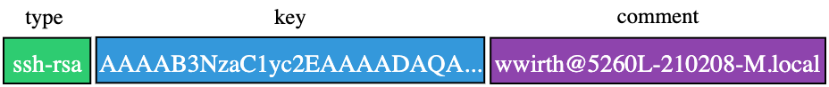
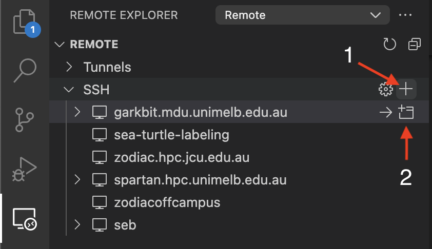
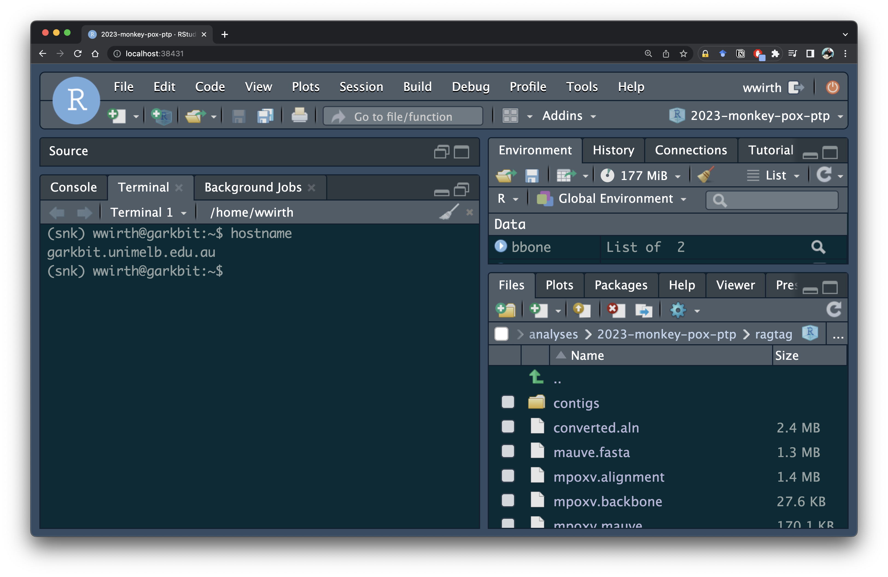

# Remote computing like a Pro: SSH config, VScode and RStudio Server

Remote computing is the ability to access and use a computer or a network from a non-local location. Analysis of large biological data can require extensive computation time and substantial computing power, often more than what personal computers are capable of providing. The modern developer environment is one that can seamlessly transition from local to remote compute. This enables researchers to access powerful computational resources on remote servers whenever they are required.

Some tools for remote computing:
- [Google Colab](https://colab.research.google.com/)
- [Posit Cloud](https://login.rstudio.cloud/login) 
- [GitHub CodeSpaces](https://github.com/features/codespaces)
- [Mosh](https://mosh.org/)
- [Tmux](https://github.com/tmux/tmux)
- [VScode](https://code.visualstudio.com/)

## VScode

VScode is a fully featured integrated development environment (IDE) produced by Microsoft. VScode is open source and quickly become the default IDE. [Download VScode](https://code.visualstudio.com/Download) and start to get a feel for how it works on your local machine. There are some very good [docs](https://code.visualstudio.com/docs/getstarted/introvideos) on how to get started.

## Setting up SSH for Remote Computing

> The Secure Shell Protocol (SSH) is a cryptographic network protocol for operating network services securely over an unsecured network - https://en.wikipedia.org/wiki/Secure_Shell

The `ssh` commamd is used to securely log into a remote server.

```bash
ssh [options] [user@]hostname [command]
```

A simple SSH command looks like:

```bash
ssh wwirth@marvin.mdu.unimelb.edu.au
```

### Private Keys (Passwordless SSH)

Transmitting your password through the internet to connect to a remote server is dangerous. Instead you should use SSH public keys as the authentication method (see [rderik's](https://rderik.com/blog/understanding-ssh-keys-and-using-keychain-to-manage-passphrase-on-macos/#the-problem-with-passwords) blog for more details).

A private key is part of a key pair used in asymmetric encryption, along with a public key. This key pair is used for securing the connection between a client and a server. The private key, as the name suggests, is meant to be kept private and secure, known only to the owner. The public key, on the other hand, is shared freely and is used by others to encrypt messages that only the private key can decrypt.

On macOS, we can use `ssh-keygen` utility to generate a new key pair. You can use `-b` to set the number of bits and increase key complexity (default is 3072). Use `-C` to set comments, makes it easy to identify which keys are for what.

**When creating a private key, enter a passphrase with a [high level of entropy](https://xkcd.com/936/) (something long)!**

```bash
ssh-keygen -t rsa
```
```
Generating public/private rsa key pair.
Enter file in which to save the key (/Users/wwirth/.ssh/id_rsa): 
/Users/wwirth/.ssh/id_rsa already exists.
Enter passphrase (empty for no passphrase): <- DO NOT LEAVE EMPTY
Enter same passphrase again: 
Your identification has been saved in /Users/wwirth/.ssh/id_rsa
Your public key has been saved in /Users/wwirth/.ssh/id_rsa.pub
The key fingerprint is:
SHA256:bfdZjvF/K0/0pNhAg+LBhMXXtl7+3UG4sGukSZYMUgQ wwirth@5260L-210208-M.local
The key's randomart image is:
+---[RSA 3072]----+
|     Eo=o  .     |
|      .+. ..o    |
|      . +...o..  |
|     . o + o.o.. |
|      . S +.=o+.o|
|         * +.*o@.|
|        o + o *oB|
|         o o .. *|
|          .   oo+|
+----[SHA256]-----+
```

(The [randomart](http://users.ece.cmu.edu/~adrian/projects/validation/validation.pdf) is an easy way for humans to validate keys)

```bash
ls ~/.shh
```
```
id_rsa.pub <- public key 
id_rsa <- private key 
```


Treat your private key (`~/.ssh/id_rsa`) as a password. Never share your private key or store it on a shared system (e.g. a HPC). Never create a private key without a passphrase. Hackers will look in `~/.ssh/` for unencrypted private keys.

The anatomy of a public SSH key:



1. Key Type: The key type is usually something like ssh-rsa, ssh-dsa, ecdsa-sha2-nistp256, or ssh-ed25519, indicating the cryptographic algorithm used.
2. Base64-encoded Key: This is the actual key, encoded in Base64 to allow it to be easily and safely transmitted and stored.
3. Comment: This is usually the username and hostname of the key owner, but can be any string. The comment has no cryptographic significance and can be changed freely.

The SSH server uses these keys in a challenge-response protocol to verify the authenticity of a user:

1. The server uses the public key to create an encrypted challenge and sends it to the client.
2. The client uses the private key to decrypt the challenge and send it back.
3. If the decrypted challenge matches what the server expects, the client is authenticated and granted access.

Add your **public** SSH key to the server to allow private-public key authentication. This command sends the public key to the server where it is append to the `.ssh/authorized_keys` files. The next time you `ssh` into the server this key will be used for authentication.

```bash
cat ~/.ssh/id_rsa.pub | ssh wwirth@marvin.mdu.unimelb.edu.au 'cat >> .ssh/authorized_keys'
```

For more information see the offical university [guide](https://dashboard.hpc.unimelb.edu.au/ssh/).

### Keychain to manage passphrase on macOS

Entering a long passphrase every time you connect to the server is laborious. This may become a security issue if users get tired of entering the long passphrase and reduce it's complexity or worse remove it completely. On macOS you can use the keychain to store ssh passphrases thus allowing [passwordless-passphraseless login](https://rderik.com/blog/understanding-ssh-keys-and-using-keychain-to-manage-passphrase-on-macos
).

Store passphrase in the Keychain:

```bash
ssh-add --apple-use-keychain ~/.ssh/id_rsa
```

Configure SSH-agent to always use the Keychain. Append the following to  `~/.ssh/config`:

```bash
Host *
  AddKeysToAgent yes
  UseKeychain yes
  IdentityFile ~/.ssh/id_rsa 
```

## VScode for remote computing

You can use VScode to access remote servers with the [Remote - SSH](https://marketplace.visualstudio.com/items?itemName=ms-vscode-remote.remote-ssh) extension. Install it using the extensions marketplace build into VScode (command+shift+X).



More details in this [blog](https://blog.wytamma.com/blog/hcp-vscode).

## Rstudio server 

RStudio Server enables you to run the RStudio IDE on a Linux server, accessed from your web browser. You can use `singularity` to install RStudio server on a powerful remote server, thus allowing interactive analysis with large compute resources.

Container platforms ([docker](https://www.docker.com/), [singularity](https://docs.sylabs.io/guides/latest/user-guide/), etc.) allow you to create and run containers that package up pieces of software in a way that is portable and reproducible.

Why use containers?

1. Data reproducibility/provenance
2. Cross-system portability
3. Simplified collaboration
4. Simplified software dependencies and management
5. Consistent testing environment

Singularity is the preferred container platform for HPC clusters as each container is only a single file, users don’t need root access to run the containers, and containers can be managed by users. Here we will use a container to easily install RStudio without sudo. 

Start by `ssh`ing to the remote server (hint use [VScode remote extension](https://github.com/Wytamma/remote-computing-bioinfo-clinic#vscode-for-remote-computing)) and create a `containers` directory.

```bash
mkdir $HOME/containers
```

Download the latest tidyverse container and save it in singularity image format (sif) at `$HOME/containers/rstudio/tidyverse_latest.sif`:

```bash
singularity pull $HOME/containers/rstudio/tidyverse_latest.sif docker://rocker/tidyverse:latest
```

Add the [rstudio](/bin/rstudio) executable to you `$PATH`:

```bash
cp bin/rstudio $HOME/.local/bin/ && chmod u+x $HOME/.local/bin/rstudio
```

Start the RStudio server:

```bash
rstudio
```


